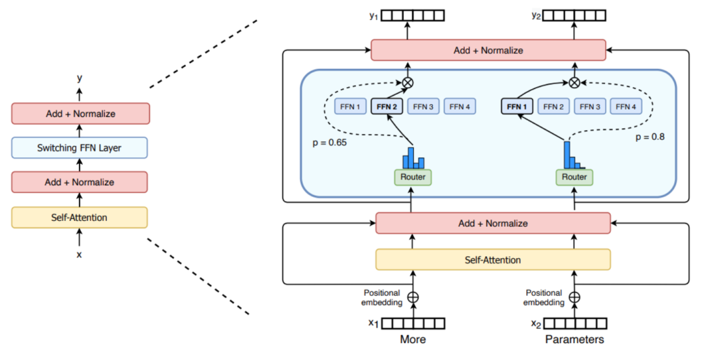
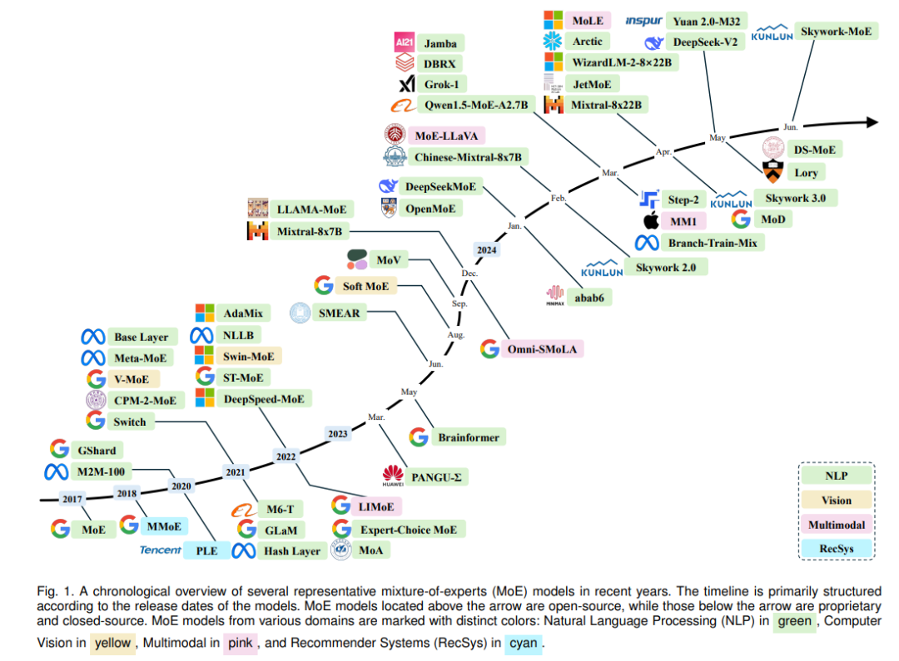
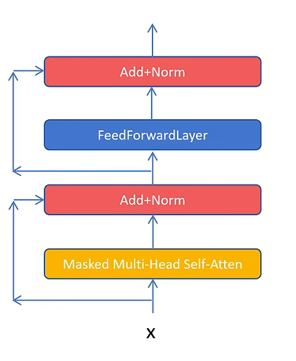
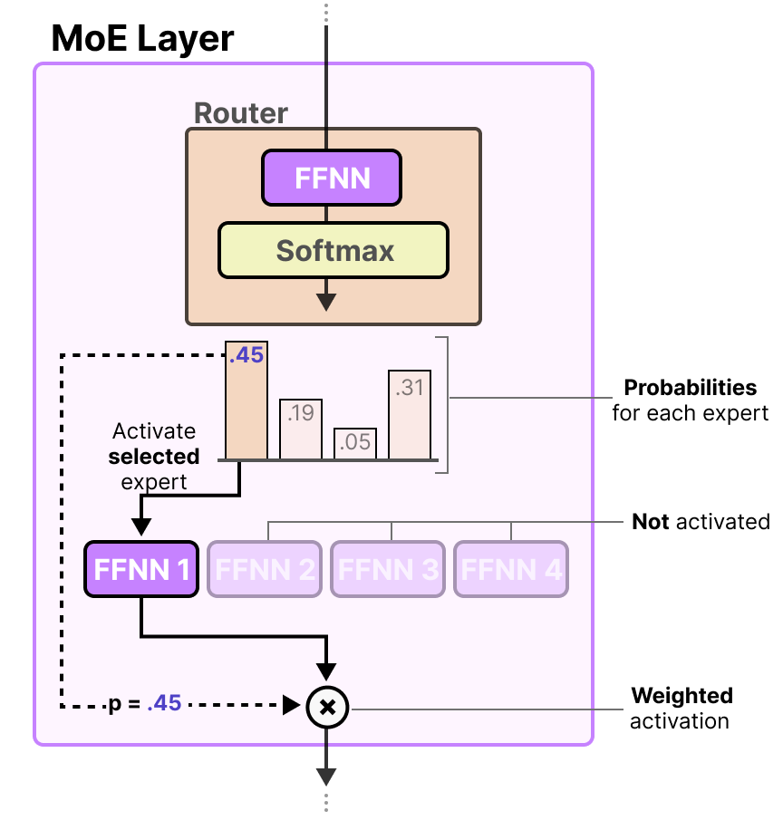

# 1-1 MoE简介

### 1. 引言

大语言模型（LLMs）近年来取得了显著的进步，在自然语言处理领域展现出卓越的能力，并在各种任务中都表现出强大的性能。随着模型规模的持续扩大，其在理解和生成复杂文本方面的能力也随之增强。然而，这种规模的增长也带来了巨大的计算和内存需求，给LLMs的训练和部署带来了严峻的挑战。为了应对这些挑战，研究人员不断探索新的模型架构和训练方法。混合专家模型（Mixture of Experts, 即MoE）作为一种有效的技术应运而生，它旨在扩展模型容量的同时，在一定程度上控制计算成本。

混合专家模型的核心思想在于将一个庞大的模型分解为多个更小的、专门化的子网络，这些子网络被称为"专家"。通过一个"门控网络"机制，MoE模型能够根据输入数据的特性，动态地选择激活最相关的专家来处理特定的输入或任务。这种方法借鉴了"分而治之"的思想，使得模型能够更好地处理复杂和异构的数据，每个专家都可以专注于学习输入空间的不同区域或不同的特征表示，从而提升整体模型的性能。MoE架构的出现，为构建更大规模、更高效的语言模型提供了一条富有潜力的路径。

### 2. MoE的发展历史

#### 2.1 MoE的起源和早期研究

MoE模型的概念最早可以追溯到1991年的论文“Adaptive Mixture of Local Experts”，由Michael Jordan和Geoffrey Hinton等人提出。这篇开创性的论文为MoE模型奠定了基础，提出了一个系统，在该系统中，单独的网络（专家）在门控网络的指导下处理训练案例的不同子集。这种将多个专家模型组合在一起以提高预测性能的思想，启发了后续众多研究工作的发展。

在随后的几年里，MoE模型的研究逐渐展开，但主要集中在相对较小规模的模型和特定的应用场景中。直到近年来，随着深度学习技术的快速发展和大规模数据集的出现，MoE模型开始在自然语言处理、计算机视觉等领域得到更广泛的应用和关注。

2010年至2015年期间，MoE模型的发展取得了重大进展。一方面，研究人员开始探索将MoE作为更深层次网络中的组件，将其嵌入到多层神经网络的某个层级中，以实现模型的大规模化和高效率并存。例如，Eigen、Ranzato和Ilya等人在他们的研究中，将MoE模型与深层神经网络相结合，通过在不同的网络层级中设置专家模型，使得模型能够更好地处理复杂的输入数据和任务，同时保持较高的计算效率。

另一方面，Yoshua Bengio等研究人员引入了条件计算的概念，这种计算方式可以根据输入数据动态激活网络的某些组件，而关闭其他不相关的组件。这种动态的计算机制为MoE模型的发展提供了新的思路，使得模型能够根据输入数据的特点，灵活地选择和激活最合适的专家进行处理，进一步提高了模型的适应性和效率。

2017年，谷歌的研究团队在论文“Outrageously Large Neural Networks: The Sparsely-Gated Mixture-of-Experts Layer”中，将MoE模型与LSTM（长短期记忆网络）相结合，应用于自然语言处理任务，特别是在机器翻译领域取得了显著的性能提升。这项工作不仅展示了MoE模型在处理大规模数据和复杂任务方面的潜力，还提出了稀疏门控机制，即在每次前向传播过程中，只激活一小部分专家来进行计算，而不是激活所有的专家。这种稀疏性的引入，使得MoE模型能够在保持较高性能的同时，显著降低计算成本，为后续MoE模型在更大规模的应用中奠定了基础。

此后，MoE模型的研究不断深入和拓展。2020年，谷歌的GShard项目首次将MoE技术引入Transformer架构中，并提供了高效的分布式并行计算架构，使得MoE模型能够在分布式环境中进行大规模的训练和推理，进一步推动了MoE模型在自然语言处理领域的应用。2021年，谷歌的Switch Transformer和GLaM模型进一步挖掘了MoE技术在自然语言处理中的应用潜力，通过优化门控机制和专家设计，实现了更优秀的性能表现。

近年来，MoE模型的应用范围不断扩大，除了在自然语言处理领域继续取得突破外，还在计算机视觉、多模态学习等领域得到了广泛的研究和应用。例如，2021年6月，V-MoE将MoE架构应用在计算机视觉领域的Transformer架构模型中，通过改进路由算法，在相关任务中实现了更高的训练效率和更好的性能表现。2022年，LIMoE作为首个应用了稀疏混合专家模型技术的多模态模型，其模型性能相较于CLIP等其他多模态模型也有所提升，展示了MoE模型在处理多模态数据方面的强大能力。

总之，MoE模型从最初的理论提出，到如今在多个领域的广泛应用和发展，经历了三十多年的不断探索和创新。随着深度学习技术的不断进步和计算资源的日益丰富，MoE模型将继续发挥其独特的优势，在解决大规模、复杂的人工智能问题中扮演着越来越重要的角色。

#### 2.2 MoE在自然语言处理领域的应用案例

在深度学习时代之前，混合专家模型主要被视为一种集成学习的技术。然而，随着深度学习的兴起，MoE在构建极大规模模型方面找到了新的应用，成为执行条件计算的一种有效手段。与经典的MoE不同，在深度学习中，MoE模型对于每个查询通常只涉及少数几个专家的输出，而不是所有专家的加权总和。这种转变的关键目标是降低计算成本。

最早将MoE应用于深度学习的论文可以追溯到2013年，该论文提出在深度神经网络的每一层使用不同的门控网络。具体来说，每个门控网络都是一个线性-ReLU-线性-Softmax网络，而每个专家网络都是一个线性-ReLU网络。然而，由于从门控网络输出的不是稀疏的，因此需要所有专家的输出，并没有实现条件计算。因此，在深度学习中使用MoE的主要目标是减少计算成本，这意味着对于每个查询，应该只查询一小部分专家。

自然语言处理领域中MoE的一个重要应用案例是2017年由Google Brain的研究人员提出的Sparsely-Gated Mixture-of-Experts Layer。该层使用前馈网络作为专家，并采用线性-Softmax门控机制。与之前提出的硬MoE类似，它通过仅对Top-K个专家的输出进行加权求和来实现稀疏性。这种稀疏门控MoE层被成功应用于机器翻译等任务，使得模型能够扩展到1370亿参数的规模，同时在推理时保持较低的计算成本，因为每个输入只激活最相关的专家。

#### 2.3 MoE的优势

混合专家模型架构使得构建包含数十亿甚至数万亿参数的大规模模型成为可能，同时能够显著降低预训练期间的计算成本，并在推理时实现更快的性能。这种效率的实现主要归功于MoE能够选择性地激活给定任务所需的特定专家，而不是为每个任务都激活整个神经网络。近年来，随着用于生成式AI的领先深度学习模型变得越来越大且计算需求越来越高，混合专家模型提供了一种解决更大模型容量和更小模型效率之间权衡的方法。这在自然语言处理（NLP）领域得到了最显著的探索：在大语言模型中，如Mistral的Mixtral 8x7B和DeepSeek，DeepSeek V2，DeepSeek V3，（以及根据一些猜测OpenAI的GPT-4）都采用了MoE架构。

MoE架构在大语言模型中引入带来了多方面的优势：

- 性能：通过选择性地激活与给定任务最相关的专家，MoE模型避免了不必要的计算，从而提高了速度并降低了资源消耗。

- 灵活性：专家的多样化能力使得MoE模型具有高度的灵活性。通过调用具有专门能力的专家，MoE模型可以在更广泛的任务范围内取得成功。

- 容错性：MoE的"分而治之"方法，其中任务是分开执行的，增强了模型对故障的弹性。如果一个专家遇到问题，不一定会影响整个模型的功能。

- 可扩展性：将复杂问题分解为更小、更易于管理的任务有助于MoE模型处理日益复杂的输入。

- 模型容量：相对于相同计算成本的稠密模型，MoE模型可以显著增加模型参数量，从而提高模型容量。

- 训练成本降低：在固定的时间或计算成本约束下，MoE模型可以处理更多tokens，从而更有效地训练更大的模型。

- 延迟降低：在处理长提示和大型batches时，MoE架构可以降低首次token的serving延迟。

- 领域专家分配：专家可以学习处理不同的领域或任务，使得模型能够更好地理解和生成特定领域的文本。

- 更好的泛化能力：通过组合多个专家的预测，MoE模型可以提高泛化性能并减少过拟合。

### 3. MoE架构的核心算法原理

#### 3.1 专家网络的构成

在混合专家模型（MoE）中，专家网络是构成模型基本构建块的子网络。每个专家都设计成专注于处理输入数据的一个特定子集或执行特定的任务。专家网络本身可以是任何类型的神经网络架构，这包括但不限于传统的前馈网络（Feed-Forward Networks, FFNs）、卷积神经网络（Convolutional Neural Networks, CNNs）以及在自然语言处理领域广泛应用的Transformer模块。

在大语言模型（LLMs）的背景下，专家网络通常实现为Transformer模块内部的前馈网络（FFN）层。

例如，在Mistral AI发布的Mixtral 8x7B模型中，每一层都包含8个专家，每个专家都是一个拥有70亿参数的前馈块。这些专家网络通过在特定的数据子集上进行训练，从而能够专注于学习特定的任务或输入模式。例如，在一个语言处理任务中，一个专家可能专注于处理语法结构，而另一个专家则可能擅长理解语义信息。这种专门化的训练使得每个专家都能在其特定的领域内表现出色。

专家网络架构的灵活性是MoE模型的一个关键优势。通过选择适合特定类型数据或任务的专家网络，MoE模型能够展现出极高的通用性。在LLMs中，将Transformer架构中的FFN层复制并作为专家是一种常见的做法，这表明了前馈组件在捕获专门知识方面的重要性。通过复制这些计算密集型且对模型容量至关重要的层，并使它们专门化，MoE模型能够有效地扩展其能力，而无需成比例地增加计算成本。

#### 3.2 门控机制的工作方式

门控网络（也称为路由网络）在混合专家模型（MoE）中扮演着至关重要的角色。它的主要职责是根据输入的特性，决定将哪些输入tokens发送给哪些专家网络进行处理。门控网络通常是一个相对轻量级的神经网络，它接收与专家网络相同的输入。

门控网络的输出是一个概率分布或权重向量，这个向量指示了每个专家应该在多大程度上处理当前的输入。一种常用的门控函数是Softmax函数，它可以将门控网络的原始输出转换为一个归一化的概率分布，表示每个专家被选择的概率。

门控网络的训练与专家网络是同步进行的，其目标是学习如何将输入有效地路由到最适合处理该输入的专家。门控机制是MoE模型实现条件计算的关键，它允许模型根据输入数据的特性选择性地激活其容量，从而避免了对每个输入都激活整个模型的计算开销。门控网络和专家网络的联合训练确保了门控能够有效地将输入导向那些能够最好地处理它们的专门化专家。

#### 3.3 Token的路由选择

在混合专家模型（MoE）中，token的路由选择是指将输入序列中的每个token分配给一个或多个专家网络进行处理的过程。研究人员已经提出了多种token路由策略，每种策略都有其独特的特点和适用场景：

Top-K路由：这是最直接的方法之一。门控网络为每个专家计算一个亲和力得分，然后选择得分最高的前K个专家，并将当前的输入数据发送给这些选定的专家进行处理。例如，Mistral AI的Mixtral 8x7B模型就采用了Top-2路由策略，意味着对于每个token，门控网络会选择两个最合适的专家进行处理。而Google的Switch Transformer则使用了更为极端的Top-1路由，每个token只被发送给一个最匹配的专家。

专家选择路由：在这种方法中，路由的方向与Top-K路由相反。不是由数据（token）选择专家，而是由专家主动选择它们认为最适合处理的数据（token）。每个专家通常具有一定的处理容量，并会选择它认为最相关的Top-K个tokens进行处理。这种策略的主要目标是实现更好的负载均衡，并允许每个token被不同数量的专家处理。

稀疏路由：这种方法的核心思想是对于每个输入数据点（通常是token），只激活网络中的一小部分专家。这种方法旨在创建一个稀疏的网络，从而减少计算资源的使用，与稠密路由（所有专家都为每个数据点激活）相比，稀疏路由在计算效率方面具有显著优势。

随机路由：在某些Top-K路由的变体中，例如在Top-2的设置中，虽然总是会选择得分最高的专家，但第二个专家可能会以与其权重成比例的概率被随机选择。这种方法可以在一定程度上增加路由的随机性，有助于探索不同的专家组合，并可能改善模型的泛化能力。

选择哪种路由策略对于MoE模型的性能、效率以及专家之间的负载均衡具有重要的影响。从简单的Top-K路由到更复杂的专家选择路由的演变，反映了研究人员在不断探索和优化路由过程，以期获得更好的模型性能和更高的计算效率。

### 4. MoE架构中常用的数学公式

#### 4.1 门控网络的计算公式

门控网络在混合专家模型（MoE）中负责为每个专家生成一个权重，以决定其对当前输入的贡献程度。一种常见的实现方式是使用Softmax函数来产生专家权重的概率分布。给定输入 $x$ 和门控网络的权重矩阵 $W_g$，专家权重的概率向量 $G(x)$ 可以表示为：

$$G(x)=\text{Softmax}(x \cdot W_g)$$

其中，$x \cdot W_g$ 表示输入与权重矩阵的乘积，Softmax函数将结果转换为概率分布。

在Sparsely-Gated MoE中，为了实现稀疏性，通常使用Noisy Top-K Gating。这个过程首先计算一个带有噪声的激活值 $H(x)_i$：

$$H(x)_i = (x \cdot W_g)_i + \text{StandardNormal()} \cdot \text{Softplus}((x \cdot W_{noise})_i)$$

然后，使用一个$KeepTopK$函数来保留向量 $H(x)$ 中最大的前 $k$ 个元素，并将其他元素设置为 $-\infty$：

$$\text{KeepTopK}(v, k)_i = \begin{cases}
v_i & \text{if } v_i \text{ is in the top } k \text{ elements of } v, \\
-\infty & \text{otherwise}.
\end{cases}$$

最后，对结果应用$Softmax$函数得到门控网络的输出 $G(x)$：

$$G(x) = \text{Softmax}(\text{KeepTopK}(H(x), k))$$

对于Top-K路由，首先计算选择每个专家的概率 $P$：

$$P = \text{Softmax}(W_r \cdot x^T)$$

其中，$W_r$ 是可学习的参数。然后，根据概率 $P$ 选择前$K$个专家，并对这些选定专家的概率进行归一化，得到权重 $g_i(x)$：

$$g_i(x) = \begin{cases}
\frac{P_i}{\sum_{j \in \text{TopK}(P)} P_j} & \text{if } i \in \text{TopK}(P), \\
0 & \text{if } i \notin \text{TopK}(P).
\end{cases}$$

$Softmax$函数在门控机制中的应用使得模型能够以概率的方式选择专家，这允许不同的专家根据其相关性对输入做出不同程度的贡献。而Noisy Top-K Gating中噪声的引入有助于在训练过程中进行探索，并可能通过防止门控网络过早地变得过于确定性来改善负载均衡。

#### 4.2 损失函数

混合专家模型（MoE）的训练通常涉及最小化一个损失函数，该损失函数旨在优化专家网络的性能以及门控网络路由输入的有效性。早期的MoE模型有时会使用均方误差（Mean Squared Error, MSE）损失函数。如果 $d$ 是期望输出，$o_i$ 是专家 $i$ 的输出，$p_i$ 是门控网络分配给专家 $i$ 的概率，则MSE损失可以表示为：

$$E = \|d - \sum_i p_i o_i\|^2$$

在《Adaptive Mixture of Local Experts》这篇论文中，提出了基于负对数似然的损失函数。如果 $g_J(x)$ 是门控函数对于专家 $J$ 的输出，$p_J(y;x)$ 是专家 $J$ 对于输入 $x$ 预测输出 $y$ 的概率密度函数，则混合专家的总概率密度函数为：

$$p(y;x) = \sum_J g_J(x) p_J(y;x)$$

训练的目标是最大化训练数据的对数似然函数。

为了解决MoE模型中常见的负载均衡问题，通常会在总损失函数中添加辅助损失函数。例如，Switch Transformer使用了一个辅助损失函数来鼓励专家之间的均匀负载。如果 $s_{ij}$ 是token $i$ 被路由到专家 $j$ 的分数，$N$ 是batch中的token数量，$E$ 是专家的数量，则辅助损失可以表示为：

$$L_{aux} = \frac{1}{N} \sum_{i=1}^N \left( \sum_{j=1}^E s_{ij} \right)^2$$

损失函数的设计不仅旨在优化每个专家的性能，还要确保门控网络能够有效地路由输入。专门为负载均衡设计的辅助损失项强调了在MoE模型中确保所有专家在训练期间得到有效利用的实际挑战。

#### 4.3 其他关键公式及其在模型训练和推理过程中的作用

在混合专家模型（MoE）中，专家网络的输出通常基于门控网络的权重进行加权求和，以得到最终的MoE模型的输出。如果 $y$ 是MoE的最终输出，$G(x)_i$ 是门控网络为专家 $i$ 分配的权重，$E_i(x)$ 是专家 $i$ 对于输入 $x$ 的输出，那么MoE的输出可以表示为：

$$y = \sum_{i=1}^n G(x)_i E_i(x)$$

其中，$n$ 是专家的总数。这种加权求和的方式使得模型能够利用多个专家的专门知识来处理给定的输入，从而产生更丰富和更细致的响应。

另一个关键概念是专家容量（Capacity Factor），它用于限制每个专家可以处理的tokens数量，这有助于实现负载均衡。专家容量通常被定义为每个专家可以处理的平均tokens数量乘以一个容量因子。这个容量因子是一个超参数，用于控制每个专家可以接收的最大负载，防止某些专家过载而其他专家利用不足。专家容量的概念是管理计算资源和防止单个专家过载的实用方法，尤其是在训练期间。

### 5. MoE架构的变体

#### 5.1 稀疏门控MoE

稀疏门控混合专家模型（Sparsely-gated Mixture of Experts, MoE）的核心思想是门控网络对于每个输入的token，只选择激活一小部分最相关的专家进行处理。这种稀疏性通常通过Top-K路由等方法实现，即门控网络为每个专家计算一个得分，然后只计算得分最高的前K个最相关的专家的输出。这种方法显著降低了计算成本，使得训练和推理过程更加高效。Sparsely-Gated MoE Layer是Google Brain提出的一个具体的稀疏门控MoE的实现。稀疏门控是现代MoE架构的基石，它使得模型能够扩展到前所未有的规模，同时保持计算成本在可控范围内。

#### 5.2 Top-K路由

Top-K路由是一种常用的token路由策略，其中门控网络首先为每个专家计算一个相关性得分，然后选择得分最高的前K个专家来处理当前的输入token。这里的K是一个预先设定的超参数，它决定了每个输入token将被发送给多少个专家进行处理。虽然Top-K路由实现起来相对简单，但它也可能导致负载不均衡的问题，即某些专家可能会因为频繁被选中而过载，而其他专家则可能利用不足。

#### 5.3 专家选择路由

与Top-K路由策略不同，专家选择路由（Expert Choice Routing）是一种让专家主动选择它们最适合处理的输入tokens的路由方法。在这种策略中，每个专家通常都具有一定的处理容量，并且会选择它认为最相关的Top-K个tokens进行处理。专家选择路由的主要优点在于它能够更好地实现负载均衡，并且允许每个token被不同数量的专家处理，这取决于专家的选择。

#### 5.4 其他变体及其特点和适用场景

除了上述主要的MoE架构变体之外，还有一些其他的变体，它们各自具有独特的特点和适用场景：

Switch Transformer：这是一种简化的MoE架构，其核心特点是每个输入token只被路由到一个专家，即K=1的Top-K路由。这种方法降低了路由计算和通信成本，但在负载均衡方面可能需要更精细的处理。

DeepSeek MoE：这种架构采用了细粒度的专家分割技术，将每个专家进一步划分为更小的专家，从而促进更精细的专业化。此外，DeepSeek MoE还使用了共享专家隔离的策略，某些专家被指定为"共享专家"并始终处于激活状态，用于捕获跨不同上下文的通用知识。

Mixture of Tokens (MoT)：与传统的MoE将tokens路由到专家不同，MoT首先将来自不同输入示例的tokens混合在一起，然后再将它们馈送到专家。这种方法被认为可以提高训练的稳定性以及专家资源的利用率。

Hierarchical MoE：这种架构使用多层门控网络，形成一个树状的结构。这种分层结构允许进行更复杂的路由决策，并能够学习到多层次的特征表示。

这些不同的MoE架构变体展示了该领域持续的创新，不同的设计旨在针对特定的优化目标，例如计算成本、负载均衡和专家专业化程度。

### 6. MoE架构在实际应用中可能遇到的问题及解决方案

#### 6.1 负载均衡

负载不均衡是混合专家模型（MoE）在实际应用中经常遇到的一个挑战。这种问题指的是某些专家网络可能被过度使用，处理了绝大多数的输入tokens，而其他专家则很少或根本没有被激活。这种不平衡会导致被过度使用的专家可能无法充分学习到输入空间的各个方面，而利用不足的专家则无法得到充分的训练，最终影响模型的整体性能。

为了解决负载均衡的问题，目前存在多种策略：

在评分过程中添加随机噪声 (Noisy Top-K Gating)：这种方法通过在门控网络为每个专家计算的得分上添加少量随机噪声，来增加专家选择的多样性，从而帮助更均匀地分配负载。

添加辅助负载均衡损失到总损失函数中：这种策略在训练过程中引入一个额外的损失项，其目的是鼓励门控网络将输入更均匀地路由到所有专家，从而最小化路由到每个专家的输入比例的差异。

专家选择路由 (Expert Choice Routing)：如前所述，这种路由策略允许专家主动选择它们最适合处理的tokens，从而可以更直接地控制每个专家的负载，实现更好的均衡。

为每个专家引入额外的"专家偏差"：这种方法在门控网络的输出中为每个专家添加一个可学习的偏差项。如果某个专家长时间没有被使用，其偏差会增加，从而提高它在未来被选择的可能性，反之亦然。

Loss-Free Balancing策略：最近的研究提出了一种无需辅助损失的负载均衡策略。该策略通过在做出Top-K路由决策之前，首先对每个专家的路由得分应用一个专家特定的偏差。这个偏差会根据专家最近的负载情况进行动态更新，从而持续地维持专家负载的均衡分布。

负载均衡是确保MoE模型中所有专家都得到有效训练和利用的关键挑战。通过采用上述策略，可以提高模型的性能和效率。

#### 6.2 通信开销

在分布式训练和推理的场景下，混合专家模型（MoE）可能会引入显著的通信开销。这是因为当模型的不同部分（包括门控网络和各个专家网络）分布在不同的计算设备（如GPU）上时，需要频繁地在这些设备之间交换激活值和梯度信息。例如，当输入tokens被路由到不同的专家时，如果这些专家位于不同的GPU上，就需要进行跨GPU的通信。同样，在反向传播过程中，来自不同专家的梯度也需要聚合以更新模型的参数。

为了缓解这种通信开销，研究人员和工程师们提出了多种有效的通信策略和硬件感知的模型设计方法：

优化模型部署和通信调度：Aurora是一种旨在通过优化模型在不同计算设备上的部署以及设备之间的通信调度来最小化MoE模型推理时间的方法。它通过将来自不同模型的专家共同部署在同一设备上，从而避免了同步的全对全通信的限制，提高了GPU的利用率。

引入零计算专家：MoE++架构通过在模型中引入"零计算专家"来降低计算开销，并消除FFN专家跨不同GPU的通信开销。这些零计算专家具有可忽略的参数量，可以部署在每个GPU上，从而避免了FFN专家分布在不同GPU上时产生的通信开销和负载不均衡问题。

利用Megatron-Core的优化策略：Megatron-Core是一个用于训练大型Transformer模型的框架，它提供了一些减少MoE模型通信开销的策略。这些策略包括：尽可能减小模型并行度，因为模型并行会带来通信开销并可能损害性能；确保专家并行（EP）和张量并行（TP）的通信发生在NVLink域内，因为EP和TP都是通信密集型的；以及在可能的情况下，对于专家层优先使用EP而不是TP，因为EP通常比TP具有更好的GEMM效率和更低的通信开销。

通信与计算重叠：启用通信与计算的重叠是减少通信开销的有效方法。例如，Megatron-Core允许在分布式优化器中启用参数收集和梯度减少的重叠，以及在TP大于1时启用TP通信的重叠。

通信开销是在扩展MoE模型到多个设备时需要认真考虑的关键因素。通过采用上述策略，可以在一定程度上降低这种开销，提高模型的训练和推理效率。

#### 6.3 训练稳定性

混合专家模型（MoE）由于其固有的稀疏性和复杂的路由机制，在训练过程中可能比传统的稠密模型更容易出现不稳定性，尤其是在对预训练模型进行微调时，更容易发生过拟合现象。模型的稀疏性意味着在每个训练步骤中只有一部分参数被激活，这种特性使得模型对训练数据的随机性以及参数的初始化更加敏感，从而可能导致训练过程中的不稳定性。

为了应对MoE模型的训练不稳定性问题，研究人员提出了多种解决方案：

简化路由策略：Switch Transformer是一种MoE架构的变体，它通过将每个输入token仅路由到一个最相关的专家（即Top-1路由）来简化路由策略。这种简化可以在一定程度上提高训练的稳定性，同时保持模型性能。

引入额外的损失项：在训练过程中，可以引入额外的损失项来鼓励专家之间的负载均衡，并防止门控网络过早地偏向某些特定的专家。例如，Switch Transformer就使用了额外的辅助损失来提高训练的稳定性。

采用特定的初始化方案：合适的参数初始化对于训练深度神经网络至关重要，对于MoE模型也不例外。一般来说会设计专门的初始化方案，以帮助稳定MoE模型的训练过程，尤其是在扩展到大量专家的情况下。

使用软路由而非硬路由：传统的MoE实现通常使用硬路由，即每个token被确定性地分配给一个或几个专家。而软路由则允许token以一定的权重激活多个专家，这种更平滑的路由方式可以提高训练的稳定性。

逐步增加专家数量：一些研究表明，在训练初期使用较少的专家，然后在训练过程中逐步增加专家数量，可以帮助模型更稳定地学习和扩展其能力。

#### 6.4 推理效率

尽管混合专家模型（MoE）在推理时通常只激活一部分参数，从而降低了计算成本，但一个主要的挑战是所有专家网络的参数都需要加载到内存中。这导致MoE模型在推理时可能需要比相同激活参数量的稠密模型更高的内存需求。此外，门控网络的计算以及选择和激活特定专家的过程也会增加推理的开销。

为了提高MoE模型的推理效率，研究人员正在探索多种策略：

专家并行化和负载均衡：通过将不同的专家网络分布到多个计算设备上并行执行，可以显著提高推理的吞吐量。同时，有效的负载均衡策略可以确保所有计算资源得到充分利用，避免某些设备过载而其他设备空闲。

模型压缩和量化：对MoE模型进行压缩（例如，通过剪枝不重要的参数或进行知识蒸馏）和量化（例如，将模型参数从高精度浮点数转换为低精度整数）可以显著减小模型大小并加快推理速度。

动态专家激活：研究人员正在探索更智能的门控机制，这些机制可以根据输入token的特性更精确地选择需要激活的专家，从而进一步减少不必要的计算。

专家缓存和预加载：对于某些应用场景，可以将常用的专家网络预加载到内存中，或者在推理过程中缓存已经激活过的专家，以减少从存储器加载参数的延迟。

硬件优化：针对MoE架构特点进行硬件优化，例如设计专门的硬件加速器，可以显著提高MoE模型的推理效率。

### 7. MoE架构在大语言模型中的最新研究

#### 7.1 最近几年的重要研究论文概述

近年来，混合专家模型（MoE）在大语言模型（LLMs）领域取得了显著的进展，涌现出许多重要的研究论文。2021年，Google提出的Switch Transformers展示了将MoE架构扩展到万亿参数规模的潜力，通过简单的稀疏性实现了高效的模型扩展。在路由策略方面，2022年NeurIPS上提出的"Mixture-of-Experts with Expert Choice Routing"引入了一种新颖的路由算法，该算法允许专家选择tokens而不是tokens选择专家，从而实现了更好的负载均衡和训练效率。

2023年，Mistral AI发布了Mixtral 8x7B，这是一款高质量的稀疏MoE模型，在大多数基准测试中都优于Llama 2 70B，并且具有更快的推理速度，引起了广泛关注。2024年，DeepSeek-MoE模型采用了细粒度的专家分割技术和专家选择路由算法，进一步提升了MoE模型的性能。

最近在arXiv上发表的一些研究论文也值得关注，例如关于扩展MoE语言模型的scaling laws的研究，关于将稠密LLMs转换为MoE的研究，以及关于在资源受限环境下训练300B参数MoE LLM的研究。此外，还有对MoE的算法、理论和应用进行全面综述的论文。

在ACL 2024和NeurIPS 2024上，也涌现了许多关于MoE架构的最新研究进展。这些研究包括MoE LLMs的参数压缩方法，如D2-MoE和MC-MoE，旨在降低模型大小和内存占用。还有关于MoE LLMs的专家剪枝和跳过技术的研究，以提高推理效率。针对MoE LLMs的unlearning方法（UOE）也被提出，用于从模型中移除特定知识而不影响其通用能力。此外，研究人员还在探索将MoE架构应用于多模态LLMs，例如CuMo模型，该模型将MoE融入视觉编码器和LLM中，以提升多模态任务的性能。针对细粒度MoE模型的推理框架（IFMoE）也被提出，旨在提高推理的延迟和吞吐量。最后，Loss-Free Balancing作为一种无需辅助损失的负载均衡策略，也被提出以解决MoE模型中常见的负载不均衡问题。

#### 7.2 模型规模、训练方法和性能表现

最新的混合专家模型（MoE）已经达到了惊人的规模，参数量从数千亿到万亿不等。这些模型通常通过联合训练专家网络和门控网络的方式进行训练，并依赖于大规模的数据集来学习丰富的语言表示和专门的知识。

在性能表现方面，MoE模型在各种自然语言处理基准测试中都展现出卓越的性能，通常能够超越相同计算成本的稠密模型。例如，Mistral AI的Mixtral 8x7B模型在包括语言理解、数学和代码生成等多个方面都优于参数量更大的Llama 2 70B模型。另一款引人注目的模型是DeepSeek-V3，它在某些基准测试中甚至能够与Llama 3.1相媲美，但其训练所需的计算资源却减少了11倍。这些结果充分证明了MoE架构在提高模型性能和效率方面的潜力。

#### 7.3 面临的挑战和最新的解决方案

尽管混合专家模型（MoE）在大语言模型中取得了显著的成功，但仍然面临着一些挑战，包括训练过程中的不稳定性、专家之间的负载不均衡、分布式训练和推理过程中的通信开销，以及推理效率的优化等问题。

针对这些挑战，最新的研究工作致力于开发更有效的路由算法、更精细的负载均衡策略、更高效的模型压缩和加速技术。例如，D2-MoE和MC-MoE等方法专注于对MoE LLMs的参数进行压缩，以降低模型大小和内存需求。UOE框架则专门为MoE LLMs设计了unlearning方法，用于在不影响模型通用能力的情况下移除特定的知识。IFMoE旨在提高细粒度MoE模型的推理效率，通过优化的并行机制和推测性解码来减少延迟和提高吞吐量。Loss-Free Balancing提供了一种无需引入额外辅助损失即可实现负载均衡的策略，通过动态调整专家偏差来保证专家负载的均匀分布。这些最新的研究成果表明，研究社区正积极致力于克服MoE架构的局限性，并使其更适用于广泛的应用场景。

### 8. MoE架构的未来发展趋势

#### 8.1 与其他先进技术的结合

混合专家模型（MoE）在未来有望与多模态学习等其他先进技术进行更深入的结合，从而创建出能够处理和集成来自文本、图像、音频等多种输入类型信息的更强大的模型。例如，CuMo模型就是一个将MoE架构融入视觉编码器和大语言模型的实例，旨在提升模型在多模态任务上的性能。此外，研究人员也在积极探索将MoE应用于强化学习领域，以期提高智能体的决策能力和任务执行效率。这些结合有望充分发挥MoE在扩展模型容量和提高计算效率方面的优势，并将其应用于更广泛的人工智能任务中。

#### 8.2 新的路由算法的探索

未来，针对混合专家模型（MoE）的研究将持续探索和开发更高效、更灵活的路由算法，以期实现更好的负载均衡和更高的模型性能。例如，动态路由算法可能会根据实时的专家负载水平和任务需求来灵活地重新分配任务，从而更有效地利用模型资源。此外，专家选择路由和基于亲和性的主动选择路由等更先进的路由策略也可能是未来研究的重要方向。

#### 8.3 在多模态模型和强化学习等领域的应用潜力

混合专家模型（MoE）在处理多模态数据和提升强化学习智能体性能方面展现出了巨大的应用潜力。通过让不同的专家专注于处理不同模态的数据（例如，文本、图像、音频），MoE模型可以更有效地理解和整合来自多个来源的信息。在强化学习中，MoE可以用于构建具有多个专门策略或行为的智能体，每个专家都可以负责处理环境的不同状态或执行不同的动作。此外，分层MoE结构可能在处理复杂的输入和提高特定任务的性能方面表现出色。

### 9. 总结

混合专家模型（MoE）架构通过巧妙地组合多个专门的专家网络，并利用门控机制实现对计算资源的高效分配，已经成为扩展大语言模型（LLMs）的关键技术。MoE在提高LLMs的性能、效率和可扩展性方面发挥了至关重要的作用。尽管如此，MoE架构在实际应用中仍然面临着负载均衡、通信开销和训练稳定性等挑战。然而，最新的研究工作正积极致力于开发创新的解决方案，例如更先进的路由算法、更有效的负载均衡策略以及模型压缩和加速技术，以克服这些障碍。展望未来，MoE架构在LLM的发展中将继续扮演重要的角色，并且有望与其他先进的AI技术（如多模态学习和强化学习）进行更深入的融合，开辟新的应用领域。对新的路由算法的探索以及在更广泛的应用领域（包括多模态学习和强化学习）的潜力挖掘，将是未来MoE研究的重要方向。

##### 表1：主要MoE架构的比较

| 架构名称 | 关键特性 | 路由机制 | 负载均衡策略 | 优点 | 缺点/挑战 | 示例模型 |
|---------|---------|---------|-----------|-----|---------|---------|
| Sparsely-Gated MoE | 稀疏门控 | Noisy Top-K | 辅助损失 | 高容量，低推理成本 | 训练不稳定性 | Switch Transformer, GShard, Mixtral |
| Switch Transformer | Top-1路由 | Top-1 | 辅助损失，容量因子 | 路由计算和通信成本低 | 需要仔细处理负载均衡 | Switch Transformer |
| Mixtral 8x7B | Top-2路由，8个7B专家 | Softmax over Top-2 | 容量因子 | 强大的性能，快速推理 | 内存需求高 | Mixtral 8x7B |
| Expert Choice Routing | 专家选择tokens | 专家选择Top-K | 容量限制 | 更好的负载均衡，每个token可被不同数量专家处理 | | |
| DeepSeek MoE | 细粒度专家分割，共享专家隔离 | 专家选择 | 无辅助损失 | 进一步促进专家专业化，捕获通用知识 | | DeepSeek-MoE |
| Mixture of Tokens (MoT) | 混合tokens后馈送到专家 | 混合tokens | | 提高训练稳定性和专家利用率 | | |
| Hierarchical MoE | 多层门控网络 | 多层路由 | | 更复杂的路由决策，多层次的特征学习 | | Meta AI's NLLB-200 |

##### 表2：MoE模型与稠密模型的性能比较

| 模型名称 | 架构类型 | 总参数量 | 激活参数量 (MoE) | 关键性能指标 | 训练计算量 (估计) |
|---------|---------|----------|-----------------|------------|----------------|
| Mixtral 8x7B | MoE | ~470亿 | ~130亿 | 在大多数基准测试中优于Llama 2 70B | |
| Llama 2 70B | 稠密 | 700亿 | | | |
| GPT-3.5 | 稠密 | 1750亿 | | | |
| DeepSeek-V3 | MoE | ~2360亿 | ~210亿 | 在某些方面优于Llama 3.1，但训练计算量少11倍 | |
| Switch-XXL | MoE | 3950亿 | | 在100,000步后，负对数困惑度优于FLOP匹配的T5 | |
| Switch-C | MoE | 1.571万亿 | | | |
| GShard 137B | MoE | 1365亿 | 216亿 | | |
| GLaM (64B/64E) | MoE | 1.2万亿 | 966亿 | | |
| DeepSeekMoE 145B | MoE | 1446亿 | 222亿 | | |
