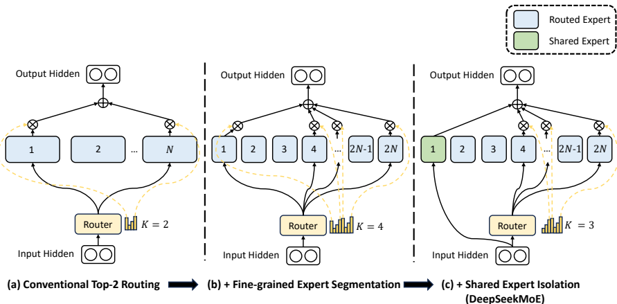
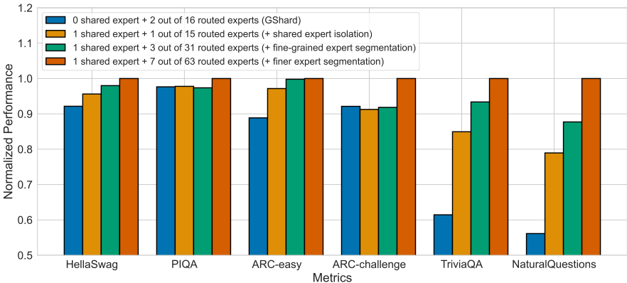
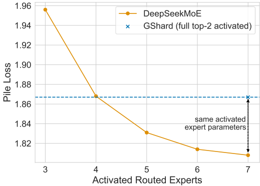

# DeepSeek MoE：让专家更加专精的MOE模型

### 1. 研究背景

**研究问题**：如何在混合专家（MoE）架构中实现专家的专业化，以便在扩展模型参数时管理计算成本。

**研究难点**：确保每个专家获得非重叠且专注的知识（知识分离），以及在有限计算预算下实现高效的参数扩展。

**相关工作**：现有的MoE架构如GShard和Switch Transformer在扩展模型参数方面取得了一定成功，但存在知识混合和冗余的问题，限制了专家的专业化。

DeepSeek MoE架构解决了在混合专家模型（MoE）中确保专家专业化的挑战。传统的MoE架构通常面临专家获取重叠知识的问题，这阻碍了它们专注于特定领域的能力。DeepSeek MoE提出了两种主要策略来实现专家的终极专业化：细粒度专家分割和共享专家隔离。

### 2. 核心思想

DeepSeek MoE通过两个关键策略来增强MoE模型中专家的专业化程度：

**细粒度专家分割**：这一策略通过拆分前馈神经网络（FFNs）的中间隐藏维度，将专家分成更多数量的、更小更专注的单元。通过在保持计算成本不变的情况下激活更多这些细粒度专家，DeepSeek MoE允许对每个token使用更灵活和适应性更强的专家组合。这种更精细的粒度使得多样化知识能够被单个专家更精确地分解和学习，从而实现更高的专业化程度。例如，与使用top-2路由的16个专家，共120种组合方式（显然，即 $\binom{16}{2} = 120$）相比，将每个专家分割成4个更小的专家并激活8个，允许超过40亿种组合（即 $\binom{64}{8}$）。

**共享专家隔离**：DeepSeek MoE将一定数量的专家隔离为"共享专家"，这些专家无论路由器的决定如何，都会对每个token始终保持激活状态。这些共享专家的目的是捕获和整合跨不同上下文的通用知识。通过在这些共享专家中集中通用知识，减轻了其他路由专家之间的冗余，提高了参数效率，并允许路由专家专注于获取更专业化的知识。

**负载平衡考虑**：为了防止路由崩溃，引入了专家级平衡损失和设备级平衡损失。专家级平衡损失通过以下公式计算：

$$
\mathcal{L}_{\text{ExpBal}} = \alpha_1 \sum_{i=1}^{N'} f_i P_i
$$

其中，$f_i$ 表示第 $i$ 个专家被选择的概率，$P_i$ 表示第 $i$ 个专家的平均选择概率。设备级平衡损失则通过以下公式计算：

$$
\mathcal{L}_{\text{DevBal}} = \alpha_2 \sum_{i=1}^{D} f_i' P_i'
$$

其中，$f_i'$ 表示第 $i$ 个设备上专家的选择概率，$P_i'$ 表示第 $i$ 个设备上专家的平均选择概率。

### 3. 技术实现分析

#### 3.1 细粒度专家分割

DeepSeek MoE通过减少FFNs的中间隐藏维度，在保持参数总量不变的同时增加了专家数量。这允许更多样化的专家，每个专家能够学习数据的更具体方面。为每个token激活更多的细粒度专家，实现了更灵活和适应性更强的组合，从而提高准确性和专业化程度。

#### 3.2 共享专家隔离

在DeepSeek MoE中，一部分专家被指定为共享专家，并始终保持激活状态。这些专家负责学习和保留适用于不同上下文的**通用知识**。这种对**通用知识的隔离减少了路由专家中的冗余**，使它们能够专注于更独特和特定的特征。

#### 3.3 路由算法

DeepSeek使用专家选择（Expert Choice, EC）路由算法来实现专家之间的最佳负载均衡。该算法确保每个专家接收适当数量的数据，防止利用不足或过载，并最大化模型的整体效率。与传统的top-K路由（tokens选择专家）不同，专家选择允许专家选择它们最擅长处理的top-K个tokens。这导致专家之间工作负载的更均衡分布。

#### 3.4 损失函数

DeepSeek MoE采用无辅助损失的负载均衡策略。这种方法避免了传统用于负载均衡的辅助损失函数可能引入的干扰梯度。通过基于最近负载动态调整每个专家的偏置，DeepSeek MoE在不影响模型效率的情况下维持平衡的专家负载。

### 4. 公式算法解读

DeepSeek MoE论文概述了该架构，使用以下公式：

MoE层的输出（$h'_{l,t}$）是共享专家输出和路由专家输出的组合：

$$
h'_{l,t} = u_{l,t} + \sum_{i=1}^{N_s} \text{FFN}_i^{(s)}(u_{l,t}) + \sum_{i=1}^{N_r} g_{i,t} \cdot \text{FFN}_i^{(r)}(u_{l,t})
$$
其中：

- $u_{l,t}$ 是MoE层的输入。
- $N_s$ 是共享专家的数量。
- $\text{FFN}_i^{(s)}$ 是第i个共享专家FFN。
- $N_r$ 是路由专家的数量。
- $g_{i,t}$ 是token t的第i个路由专家的门控值。
- $\text{FFN}_i^{(r)}$ 是第i个路由专家FFN。

门控值 $g_{i,t}$ 基于top-K路由计算：

$$
g_{i,t} = 
\begin{cases} 
\frac{s_{i,t}}{\sum_{j \in \text{TopK}(\{s_{j,t} | 1 \leq j \leq N_r\}, K_r)} s_{j,t}}, & \text{if } s_{i,t} \in \text{TopK}(\{s_{j,t} | 1 \leq j \leq N_r\}, K_r) \\
0, & \text{otherwise}
\end{cases}
$$

其中 $s_{i,t}$ 是token t的第i个路由专家的路由分数，计算方式为：

$$s_{i,t} = \text{Sigmoid}(u_{l,t}^T \cdot e_i)$$

其中 $e_i$ 是第i个路由专家的嵌入向量。

DeepSeek-V3还引入了一个互补的序列级辅助损失，用于负载均衡：

$$L_{\text{Bal}} = \alpha \sum_{i=1}^{N_r} f_i \cdot P_i$$

其中：

- $\alpha$ 是平衡因子。
- $f_i$ 是路由到第i个专家的tokens比例。
- $P_i$ 是选择第i个专家的平均概率。

### 5. 评估指标

DeepSeek MoE及其后续版本如DeepSeek-V3已在涵盖语言理解、推理、编码和数学各个方面的Benchmark上进行了评估。

#### 语言理解基准测试

| 基准测试 | 评估指标 |
|---------|---------|
| Pile-test | BPB |
| MMLU | Acc. |
| MMLU-Redux | Acc. |
| MMLU-Pro | Acc. |
| DROP | F1 |
| ARC-Easy | Acc. |
| ARC-Challenge | Acc. |
| HellaSwag | Acc. |
| PIQA | Acc. |
| WinoGrande | Acc. |
| RACE-Middle | Acc. |
| RACE-High | Acc. |
| TriviaQA | EM |
| NaturalQuestions | EM |
| AGIEval | Acc. |
| CLUEWSC | EM |
| C-Eval | Acc. |
| CMMLU | Acc. |
| CMRC | EM |
| C3 | Acc. |
| CCPM | Acc. |
| MMMLU-non-English | Acc. |

#### 代码生成基准测试

| 基准测试 | 评估指标 |
|---------|---------|
| HumanEval | Pass@1 |
| MBPP | Pass@1 |
| LiveCodeBench-Base | Pass@1 |
| CRUXEval-I | Acc. |
| CRUXEval-O | Acc. |
| HumanEval-Mul | Pass@1 |
| LiveCodeBench | Pass@1-COT, Pass@1 |
| Codeforces | Percentile |
| SWE Verified | Resolved |
| Aider-Edit | Acc. |
| Aider-Polyglot | Acc. |

#### 数学推理基准测试

| 基准测试 | 评估指标 |
|---------|---------|
| GSM8K | EM |
| MATH | EM |
| MGSM | EM |
| CMath | EM |
| AIME 2024 | Pass@1 |

**性能对比**：与GShard 2B、Hash Layer、Switch Transformer和GShard 2.9B相比，DeepSeekMoE 2B在多个基准测试中表现出色，特别是在语言建模和知识密集型任务上。

从结果上可以观察到很明显的趋势是，启用通用的shared expert显著优于不启用，且expert拆分粒度越细各benchmark上的performance越好

**与更大模型的比较**：DeepSeekMoE 2B在与GShard 1.5倍专家规模和1.5倍总参数的模型相比时，表现出相当的性能。此外，DeepSeekMoE 2B的性能接近于具有16倍FFN参数的密集模型，这为MoE模型的理论上限设定了基准。

**消融研究**：通过消融研究验证了细粒度专家分割和共享专家隔离策略的有效性。结果表明，隔离共享专家显著提高了模型性能，而细粒度分割则进一步增强了模型的灵活性和准确性。

**专家专业化分析**：DeepSeekMoE 2B在路由专家之间的冗余较低，共享专家是不可替代的，并且能够更准确地获取所需知识。

### 6. 创新点

DeepSeek MoE的主要创新包括：

- **细粒度专家分割**：为改进知识获取，实现更灵活和专业化的专家组合。
- **共享专家隔离**：通过专门指定特定专家捕获通用知识，减少路由专家之间的冗余。
- **专家选择路由**：确保专家之间的最佳负载均衡，从而实现更高效的训练和推理。
- **无辅助损失负载均衡**：在训练期间保持平衡的专家利用率，而不引入干扰梯度。
- **多头潜在注意力（MLA）**：在后续版本如DeepSeek-V3中引入，这一机制减少了长上下文的内存使用和计算开销。
- **多Token预测（MTP）**：同样在DeepSeek-V3中引入，这一训练目标提高了训练效率，并通过推测解码实现更快的推理。

### 7. 总结

DeepSeekMoE架构，通过细粒度专家分割和共享专家隔离策略，实现了MoE模型的专家专业化。实验结果表明，DeepSeekMoE 2B在多个基准测试中表现出色，接近于密集模型的性能。此外，DeepSeekMoE 16B在仅约40%的计算成本下，性能与DeepSeek 7B和LLaMA2 7B相当。未来的工作将进一步扩展到145B参数规模，并计划公开DeepSeekMoE 16B的模型检查点，以促进大规模语言模型的发展。

### Appendix QA

#### **Q1：DeepSeekMoE架构中的细粒度专家分割是如何实现的？其优势是什么？**

细粒度专家分割通过将每个专家的中间隐藏维度减少到原始大小的 $\frac{1}{m}$ 来实现。具体来说，如果原始专家的隐藏维度为 $H$，则分割后的专家隐藏维度为 $\frac{H}{m}$。为了保持计算成本不变，激活的专家数量也增加到 $m$ 倍。这样，细粒度分割使得不同专家可以专注于不同类型的数据，提高了专家的专业化水平。

其优势包括：

1. **提高专业化水平**：细粒度分割使得不同专家可以专注于不同类型的数据，减少了知识混合，提高了每个专家的专注度和专业化水平。
2. **增强灵活性**：由于每个专家的参数规模较小，可以更灵活地组合不同的专家，从而实现更精确和有针对性的知识获取。
3. **提高计算效率**：通过减少每个专家的参数数量和计算复杂度，可以在相同的计算预算下激活更多的专家，从而提高整体计算效率。

#### **Q2：DeepSeekMoE架构中的共享专家隔离策略是如何工作的？其优点是什么？**

共享专家隔离策略通过隔离某些专家作为共享专家，这些专家始终被激活，用于捕捉和整合跨上下文的共同知识。具体来说，除了细粒度分割外，还隔离了 $K_s$ 个专家作为共享专家，这些专家在所有路由中都会被激活。为了保持计算成本不变，其他路由专家的数量会相应减少。

其优点有：

1. **减少冗余**：通过共享专家隔离，可以减少其他路由专家中的冗余知识，避免多个专家学习相同的知识，从而提高参数效率和模型性能。
2. **增强泛化能力**：共享专家可以捕捉到跨上下文的共同知识，这些知识对于不同任务和场景都有益处，从而增强模型的泛化能力。
3. **提高计算效率**：由于共享专家的参数被多个路由专家共享，可以减少每个路由专家的计算负担，从而提高整体计算效率。

#### **Q3：DeepSeekMoE 16B在实验中的表现如何？与其他模型相比有哪些优势？**

DeepSeekMoE 16B在实验中表现出色，特别是在语言建模和知识密集型任务上。具体表现如下：

1. **性能对比**：与GShard 2B、Hash Layer、Switch Transformer和GShard 2.9B相比，DeepSeekMoE 16B在多个基准测试中表现出色，特别是在语言建模和知识密集型任务上。
2. **与更大模型的比较**：DeepSeekMoE 16B在与GShard 1.5倍专家规模和1.5倍总参数的模型相比时，表现出相当的性能。此外，DeepSeekMoE 16B的性能接近于具有16倍FFN参数的密集模型，这为MoE模型的理论上限设定了基准。
3. **计算效率**：DeepSeekMoE 16B在仅约40%的计算成本下，性能与DeepSeek 7B和LLaMA2 7B相当，展示了其在计算效率上的显著优势。
