# 蒙特卡洛树搜索与大语言模型的结合

### 1. 引言

由于 AlphaGo/AlphaZero 的巨大成功，在讨论 o1-like 模型时，研究者们都猜测 MCTS 是其成功的关键组件，它不仅可以在推理阶段优化决策过程，又可以产生训练数据迭代训练，所以，我们需要了解 MCTS 都是怎么与 LLM 结合使用：

- **提高复杂问题推理能力**：使用 MCTS 扩充模型的搜索空间，使其得到更加多样的答案，然后使用相关的算法选择置信度最高的作为最终结果
- **优化训练数据**：使用 MCTS 进行数据增强，然后将新数据用于模型迭代

### 2. 蒙特卡洛树搜索

蒙特卡洛树搜索 (Monte Carlo tree search, MCTS) 是一种用于某些决策过程的启发式搜索算法，常用于解决博弈树问题，该算法是在线的，即动作选择和动作执行交错进行。

MCTS 基于搜索空间的随机采样扩展搜索树，其基本过程是使用模拟来构建一棵树。已评估的状态存储在搜索树中，评估状态集是通过迭代以下四个步骤逐步构建的：

$$
Rollout = Select + Expand + Simulate + Backpropagate
$$
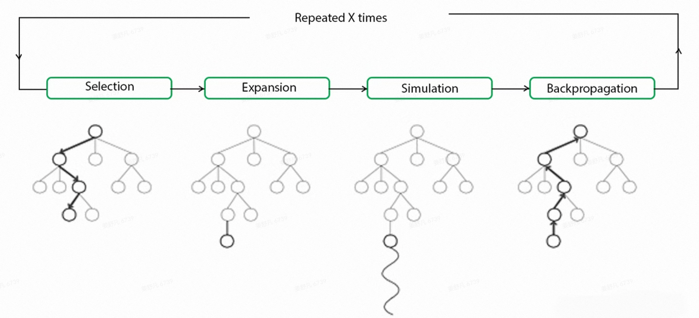

1. **选择(Selection)**：从根节点（当前游戏状态）开始，使用一种策略（如UCT算法）来沿着树向下选择连续的子节点，直到到达叶节点。其中，UCT算法平衡了探索（exploration）和利用（exploitation），每次选择具有最高 UCB1 值的子节点；
2. **拓展(Expansion)**：除非最终到达的节点是终止状态，否则在选定的叶子节点上扩展树，添加一个或多个新的子节点，每个子节点代表一个可能的合法移动。然后，从这些新节点中选择一个节点 C 进行下一步操作；
3. **模拟(Simulation)**：从扩展的节点C开始，进行一次随机模拟，直到游戏结束。在模拟过程中，随机选择移动，直到达到终止节点，模拟的结果用于评估节点 C 的价值；
4. **回溯(Backpropagation)**：将模拟的结果从叶子节点 C 反向传播回根节点，更新路径上所有节点的统计信息。根据模拟的结果，更新路径上每个节点的收益和访问次数。

一次 Rollout 为执行一轮 **Select + Expand + Simulate + Backpropagate** 的过程。

### 3. UCT 选择决策

选择决策主要使用了 UCT (Upper Confidence bounds applied to Trees) 算法，UCT 算法是 MCTS 与 UCB1 策略的结合，即 UCT = MCTS + UCB1。

UCB (Upper Confidence Bound, 置信区间上界)：在博弈树的每个节点中应选择值最大的节点 (UCB1)

$$
UCB(i)=\frac{q_i}{n_i}+c\sqrt{\frac{\ln N_i}{n_i}}
$$

$$
$$a^*=\arg\max_{a\in A(s)}\{Q(s,a)+c\sqrt{\frac{\ln N(s)}{N(s,a)}}\}
$$


- $q_i$：表示节点 $i$ 的收益
- $n_i$: 表示节点 $i$ 的访问次数
- $c$: 探索参数，理论值为 $\sqrt{2}$，用于对探索 (exploration) 和利用 (exploitation) 的平衡
- $N_i$: 表示节点 $i$ 的父节点的访问次数

其中加号前面是该节点当前的收益均值，后面的本质上是均值的标准差。这个公式反映：收益均值越大，被选中的概率越大，起到了 exploit 的作用；同时第二项使得那些被选次数较少的节点也会得到试验机会，起到了 explore 的作用。

### 4. 代码框架

#### MCTS

```python
class MCTS:
    "Monte Carlo tree searcher. First rollout the tree then choose a move."
    def __init__(self, exploration_weight=1):
        self.Q = defaultdict(int)  # total reward of each node
        self.N = defaultdict(int)  # total visit count for each node
        self.children = dict()  # children of each node
        self.exploration_weight = exploration_weight
```

#### 选择 (Selection)

```python
def _select(self, node):
    path = []
    while True:
        path.append(node)
        # (node 未被扩展) 或 (node 为终止节点)
        if node not in self.children or not self.children[node]:
            return path
        unexplored = self.children[node] - self.children.keys()
        if unexplored:
            n = unexplored.pop()
            path.append(n)
            return path
        node = self._uct_select(node) 

def _uct_select(self, node):
    assert all(n in self.children for n in self.children[node])
    log_N_vertex = math.log(self.N[node])
    def uct(n):
        return self.Q[n] / self.N[n] + self.exploration_weight * math.sqrt(
                   log_N_vertex / self.N[n]
               )
    return max(self.children[node], key=uct)
```

#### 拓展 (Expansion)

```python
def _expand(self, node):
    if node in self.children:
        return
    self.children[node] = node.find_children()
```

#### 模拟 (Simulation)

```python
def _simulate(self, node):
    while True:
        if node.is_terminal():
            reward = node.reward()
        node = node.find_random_child()
```

#### 回溯 (Backpropagation)

```python
def _backpropagate(self, path, reward):
    for node in reversed(path):
        self.N[node] += 1
        self.Q[node] += reward
```

#### Rollout

```python
def do_rollout(self, node):
    path = self._select(node)
    leaf = path[-1]
    self._expand(leaf)
    reward = self._simulate(leaf)
    self._backpropagate(path, reward)
```

#### Choose  $\arg\max_{a\in A(s)}Q(s_0,a)$

```python
def choose(self, node):
    if node not in self.children:
        return node.find_random_child()
    def score(n):
        if self.N[n] == 0:
            return float("-inf")
        return self.Q[n] / self.N[n]
    return max(self.children[node], key=score)
```

### 5. PUCT 选择决策

传统的 MCTS 一个明显的缺点是Q(s,a)需要执行完整的 Simulation 操作。

在 AlphaZero 中，选择策略使用了UCT的变体，PUCT（Predictor Upper Confidence Bound for Trees）：

$$
a^*=\arg\max_{a\in A(s)}\left[Q(s,a)+c_{puct}P(s,a)\frac{\sqrt{\sum_b N(s,b)}}{1+N(s,a)}\right]
$$


其中，前半部分鼓励模型选择得分高的动作，后半部分鼓励模型探索，P(s,a)为动作概率，用于提升探索的效率，$c_{puct}$同样是平衡因子，用于平衡探索和利用。

当选择一个叶子结点$s_t$时，需要对叶子节点进行扩展和评估，不同于传统的 MCTS，AlphaZero 用神经网络的预测$V(s_t)$代替了 Simulation（同时也预测$P(s_t|\cdot)$），这样显然提升了搜索的效率。

回溯过程中，用$V(s_t)$来更新从根结点到叶子结点的所有$Q(s,a)$：

$$
N(s,a) \leftarrow N(s,a)+1
$$

$$
Q(s,a) \leftarrow \frac{1}{N(s,a)}\sum_{j=1}^i I_{s,a \rightarrow s_t}V(s_t)^{(j)}
$$


#### 与传统MCTS的差异

1. 传统 MCTS 方法中，$Q(s,a)$基于完整 Simulation 得到的估计值。而 AlphaZero 直接用神经网络估计$V(s_t)$，从而能够有效减少搜索的深度，大大提高了估计的效率。

2. 传统 MCTS 方法中，探索项的分子仅仅是访问次数，与状态动作对$(s,a)$的性质无关。AlphaZero 考虑到了在人类专家经验中，不同的状态动作对$(s,a)$出现的先验概率$P(s,a)$，有效地减少了搜索的宽度。

### 6. LLM + MCTS 推理决策

#### LLM 与 MCTS 结合的难点

- **广阔的搜索空间**，由于词表或者句子的组合情况非常巨大，导致搜索效率较低
- **模糊的反馈**，语言模型有可能存在多个 token 都合适，或者多种语言表达都合理的情况，没有绝对的正确和错误，导致反馈信息模糊

#### 实际应用中如何定义状态、动作、奖励

#### RAP

> LLM（作为推理者）在 LLM（作为世界模型）和任务特定奖励的指导下逐步构建推理树，并在广度与深度之间取得适当的平衡，从而有效地获得高奖励推理路径

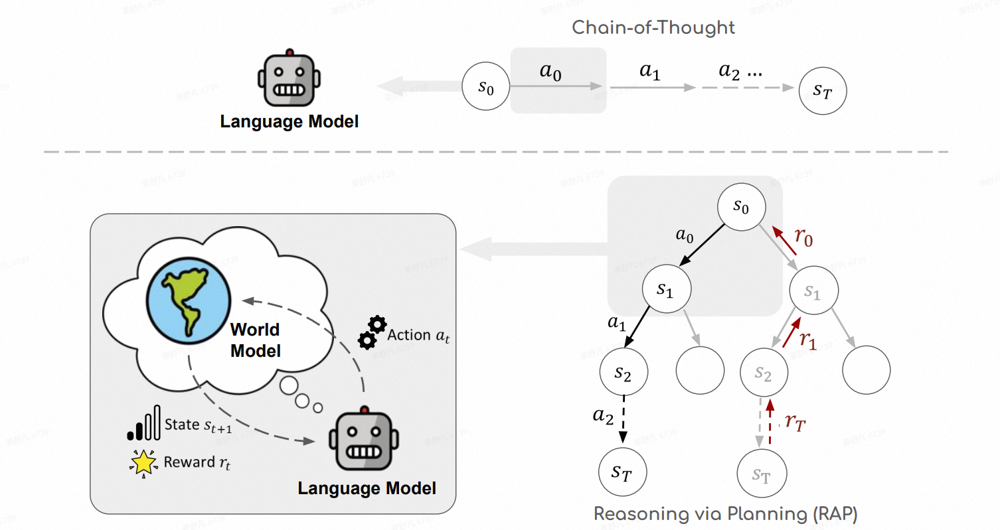

**三种应用示例**

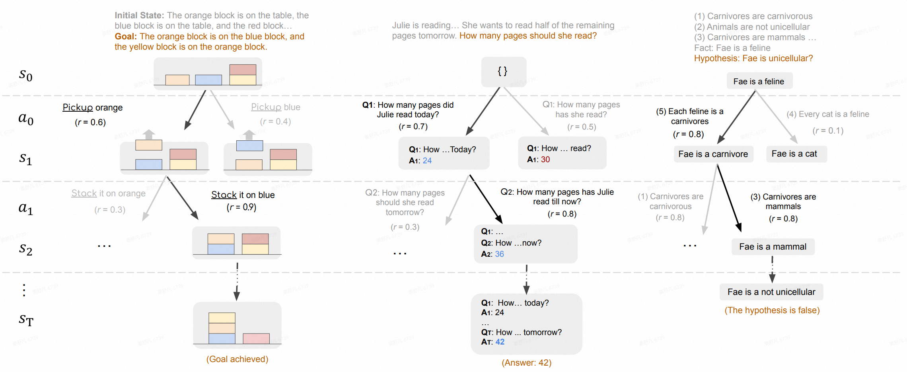

1. **RAP用于 Blocksworld 中的计划生成**
   
   - 状态：块到目前为止的状态
   - 动作：对块的四种操作（STACK、UNSTACK、PUT 和 PICKUP）
   - 奖励：首先用一些示例测试用例及其解决方案提示 LLM，然后计算给定当前状态下动作的对数概率，表示为 r1。当离目标只剩几步时，它通常比较准确，而对于遥远的目标则不那么可靠。此外，将执行动作后的新状态与目标进行比较，并提供奖励 r2，与满足条件的块的数目成比例
   
   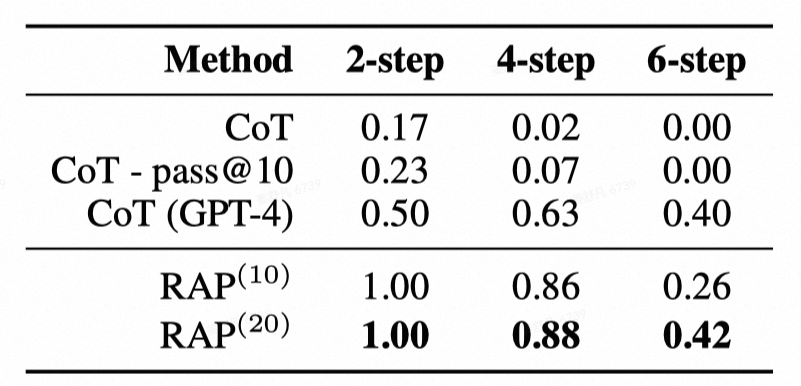
   
2. **GSM8K 中的数学推理**
   - 状态：定义为中间变量
   - 动作：是提出关于新中间变量的增量子问题
   - 奖励：将 LLM 对上个动作的有用性自评和当前状态的置信度相结合，这个奖励函数鼓励提出更相关且有用的子问题

   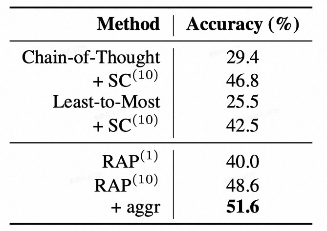
   
3. **PrOntoQA 中的逻辑推理**
   
   - 状态：关注的事实，类似于人类用于推理的工作记忆
   - 动作：定义为从事实集中选择一个规则
   - 奖励：通过自我评估计算，具体来说，用一些带有标签的例子来提示 LLM，以帮助它更好地理解推理步骤的质量
   
   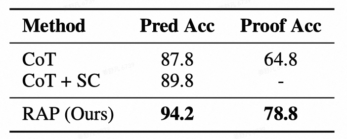

#### 如何高效地构建动作空间

#### rStar

> 按照人类的思维方式，总结出了可能采用的 5 种解决问题的方法，构造一颗搜索树

MCTS 的作用主要是将复杂问题拆分成多个或者多步执行的子问题，其依据是设定的动作空间，即树搜索的范围。而 LLM 的作用是根据指定的动作生成候选答案或者生成评估验证的反馈，那么存在的问题是 LLM 输出通常是无限、连续的动作空间。那么如何设置动作空间以保证既充分又完备

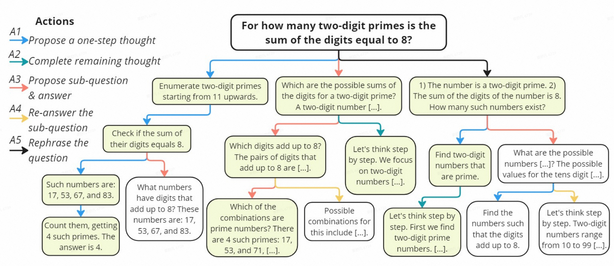


**A1（propose a one-step-thought）**

每次提出一个推理step，直到生成最后的答案。每个step的形式是 **"该step的推理文字+该step的答案"**，最后一个step以"The answer is"开头，表示产出了原始问题的最终答案：

```
Instruction:
There are 15 trees in the grove. Grove workers will plant trees in the grove today. After they are done, there will be 21 trees. How many trees did the grove workers plant today?

Response:
Let's think step by step.
Step 1: Identify the initial number of trees. The problem states there are 15 trees in the grove.
Step 2: Identify the final number of trees. The problem states there will be 21 trees after the workers are done planting.
Step 3: Subtract the initial number of trees from the final number of trees to find out how many trees were planted.
Step 4: Therefore, the grove workers planted 21 (final number of trees) - 15 (initial number of trees) = 6 trees today.
Step 5: The answer is 6.
```

**A2（propose the remaining thought steps）**

对于简单的问题，并不需要步步思考，可以一次性通过一些简单的推理后直接给出答案：

```
Instruction:
There are 15 trees in the grove. Grove workers will plant trees in the grove today. After they are done, there will be 21 trees. How many trees did the grove workers plant today?

Response:
Let's think step by step. There are 15 trees originally. Then there were 21 trees after some more were planted. So there must have been 21 - 15 = 6. The answer is: 6.
```

**A3 (propose next sub-question along with its answer)**

把原始问题拆解成很多子问题，然后回答一个个子问题，最终给出答案，例如：

```
Question 1: Four years ago, Kody was only half as old as Mohamed. If Mohamed is currently twice as 30 years old, how old is Kody?

Question 1.1: How old is Mohamed currently?
Answer 1.1: Mohamed is twice as old as 30 years, which means he is 30 * 2 = 60 years old. 

Question 1.2: What was Kody's age four years ago, given that it was half of Mohamed's age at that time?
Answer 1.2: Four years ago, Mohamed was 60 - 4 = 56 years old, so Kody was half of that, which is 56 / 2 = 28 years old.

Question 1.3: Now we can answer the question: How old is Kody?
Answer 1.3: Kody is currently 28 + 4 = 32 years old. The answer is 32.
```

其中，Question 1.3属于终结类型的子问题，因为回答它就等于回答了最终答案。

**A4 (Answer the sub-question again)**

与A3搭配使用，例如，对于A3的Question1.1，并不确定Answer1.1是否正确，此时重新再思考一次Answer1.1的答案。由于只是对某一个子答案做修正，可以采用A2的方式，做一些简单的推理，重新取得Answer1.1，相当于把Answer1.1用做一次A2得到的输出结果进行替代：

```
Question 1: Four years ago, Kody was only half as old as Mohamed. If Mohamed is currently twice as 30 years old, how old is Kody?

Question 1.1: How old is Mohamed currently?
Answer 1.1: Mohamed is twice as old as 30 years, which means he is 30 * 2 = 60 years old. 

Question 1.2: What was Kody's age four years ago, given that it was half of Mohamed's age at that time?
Answer 1.2: Mohamed was 60 years old, so Kody was half of that, which is 60 / 2 = 30 years old.

(
### Instruction:
Four years ago, Kody was only half as old as Mohamed. If Mohamed is currently twice as 30 years old, what was Kody's age four years ago?
### Response:
Let's think step by step. Mohamed is twice as old as 30 years, which means he is 30 * 2 = 60 years old. Four years ago, Mohamed was 60 - 4 = 56 years old, so Kody was half of that, which is 56 / 2 = 28 years old.
)

Revised Answer 1.2: Let's think step by step. Mohamed is twice as old as 30 years, which means he is 30 * 2 = 60 years old. Four years ago, Mohamed was 60 - 4 = 56 years old, so Kody was half of that, which is 56 / 2 = 28 years old.
```

**A5（Rephrase the question/sub-question）**

在大段的原始题目描述中，把关键信息提取出来，例如：Condition1..., Condition2等等。可以先通过这种方式改写原始题目/子题目，然后再做回答：

```
Original Question: Olivia has $23. She bought five bagels for $3 each. How much money does she have left?

Rephrased Question: Given a list of conditions, please answer the question. 
Condition 1: Olivia starts with $23. 
Condition 2: She buys five bagels, each costing $3. 
Question: How much money does Olivia have remaining after her purchase?
```

#### 如何进行过程验证和评估

过程监督可以说是 MCTS + LLM 中的关键步骤，无论生成的结果是否正确，无法有效评估和判断，则同样是没有价值的，当前的过程评估方法大概有以下几种：

- **专家式**：使用另一个更好的（当然也可以是本身）的 LLM 作为专家来判断生成的结果是否正确、合理
- **集成式**：类似于集成学习的方法，即同时生成多个答案，通过答案之间的一致性来进行判断 （rStar 采用同行评审般的一致性选择）
- **奖励式**：即专门训练一个 PRM 来为结果进行打分，其思想即源于 RL 的 reward model


### 7. MCTS 优化 LLM 训练

#### 如何评估推理步骤的质量，自动标注推理过程的标签

#### MATH-SHEPHERD

> 基于 MCTS 中 simulate 的思想，将推理步骤的质量定义为 '它推断正确答案的潜力'，使用多次随机 Simulate 标注推理过程的标签，用于训练一个好的 PRM

**Outcome Reward Model & Process Reward Model**

$$L_{ORM} = y_s \log r_s + (1-y_s) \log(1-r_s)$$

其中$y_s$是标准答案，$y_s=1$表示正确，$y_s=0$表示错误。

$$L_{PRM} = \sum_{i=1}^K y_{s_i} \log r_{s_i} + (1-y_{s_i}) \log(1-r_{s_i})$$

其中$y_{s_i}$是标准答案，$y_{s_i}=1$表示步骤$s_i$正确，$y_{s_i}=0$表示步骤$s_i$错误。

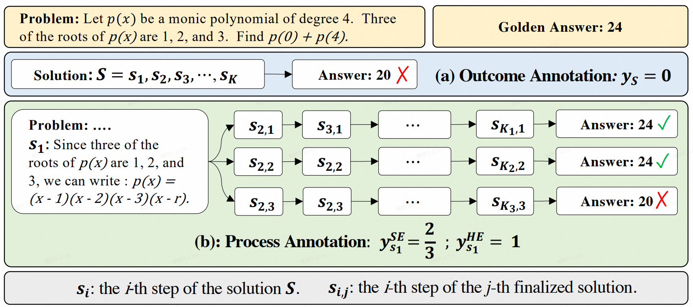

**Hard Estimation (HE)**

$$y_{s_i}^{HE} = \begin{cases} 
1 & \exists a_j \in A, a_j = a^* \\
0 & \text{Otherwise}
\end{cases}$$

**Soft Estimation (SE)**

$$y_{s_i}^{SE} = \frac{1}{N}\sum_{j=1}^N I(a_j = a^*)$$

**Ranking for Verification (Self-Consistency + Reward Model)**

$$a_{sc+rm} = \arg\max_a \sum_{i=1}^N I(a_i = a) \cdot RM(p, S_i)$$

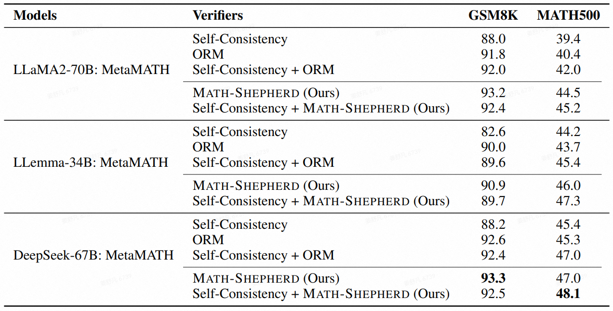

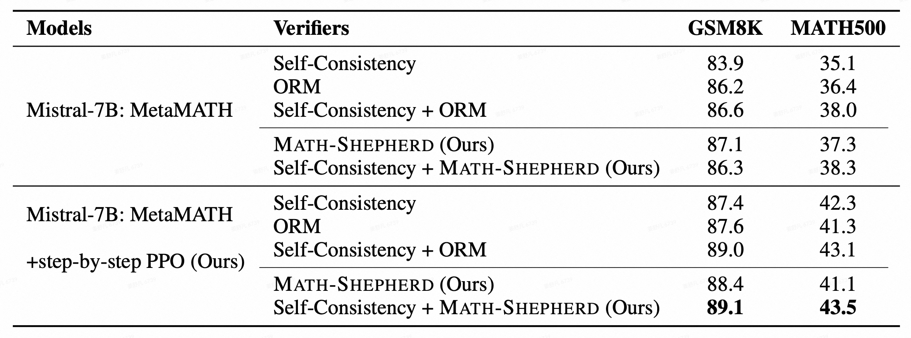

#### 如何自动获取高质量推理路径，并有效处理奖励信号以进行验证和 offline learning 自我训练

#### ReST-MCTS*

> 使用 MCTS 优化 LLM 的训练，不同于 AlphaGo 中 MCTS + RL 的 online learning 的形式，而是 offline learning 的形式，即通过产生更加高质量的数据来训练 LLM

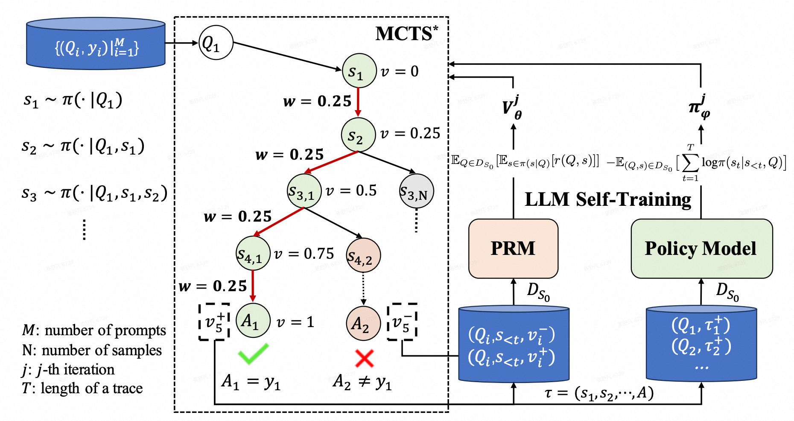

- $v_k$: 部分解$p_k=[s_1,s_2,...,s_k]$的质量；
- $m_k$: 部分解$p_k$的推理距离$m_k$为从$p_k$开始，策略模型达到正确答案所需的最小推理步数；
- $w_{s_k}$: 单步加权奖励$w_{s_k}$，反映当前步骤$s_k$的质量，基于常见的 PRM 奖励$r_{s_k}$，进一步将推理距离作为权重因子，反应$s_k$的增量进展；

**Quality Value 的计算**

$$v_k = \begin{cases} 
0, & k=0 \\
\max(v_{k-1}+w_{s_k}, 0), & \text{else}
\end{cases}$$

$$UCB(i) = v_i + c\sqrt{\frac{\ln N_i}{n_i}}$$

**Weighted Reward 的计算**

$$w_{s_k} = \frac{m_{k+1}}{1-v_{k-1}}(1-2r_{s_k}),  k=1,2,\cdots$$

其中，$m_k=K-k$，$K$是解决方案$s$的总推理步数，$r_{s_k}$沿用了MATH-SHEPHERD的方法。

所以，一旦我们有了精确的$r_{s_k}$(PRM) 和$m_k$的预估，就可以直接预测部分解决方案$p_k$的质量值$v_k$来引导搜索，并且可以简单地训练一个过程奖励模型$V_\theta$来预测$v_k$，作为常见 PRM 的一种变体。

**训练流程 Step0**

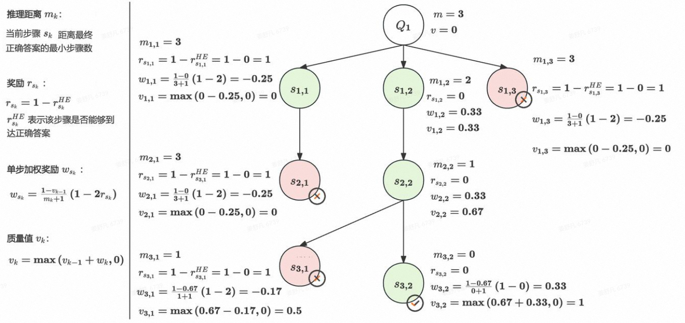

初始时刻用 BFS 构建搜索树，根据数据的标签验证所有叶节点的答案是否正确，计算$m_k$和使用硬估计（Hard Estimation）方法计算$r_{s_k}$，按照上述公式计算$v_k$。将所有提取的部分解决方案及其质量值$v_k$组合成训练集$DV_0$。这些数据用于训练初始值过程奖励模型$V_\theta$，使其能够评估部分解决方案的质量:

$$L_{MSE} = E_{(q,p,v)\sim DV_0}|V_\theta(p|q)-v|^2$$

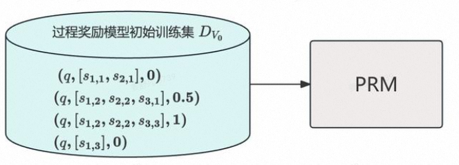

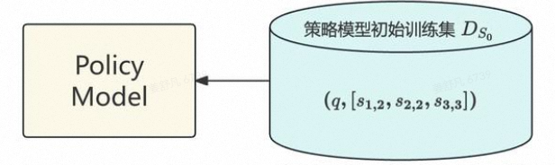

**训练流程 Step1**

由于不想直接像 AlphaZero 一样简化掉 Simulation 阶段，所以最关键的步骤为 MCTS* 中的贪婪蒙特卡洛展开 (Greedy MC Rollout)，从扩展的节点C′开始，逐步生成推理步骤，并使用过程奖励模型$V_\theta$评估每一步的质量值。记录模拟过程中获得的最大质量值$v_{max}$，使用加权平均方法更新节点的质量值：

$$v_{C'} = \alpha v_{C'} + (1-\alpha)v_{max}$$

Greedy MC Rollout 通过选择最有价值的推理路径，减少了搜索空间，提升了搜索效率。

**训练流程 Step2**

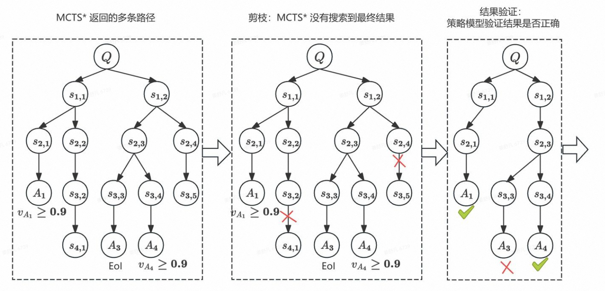

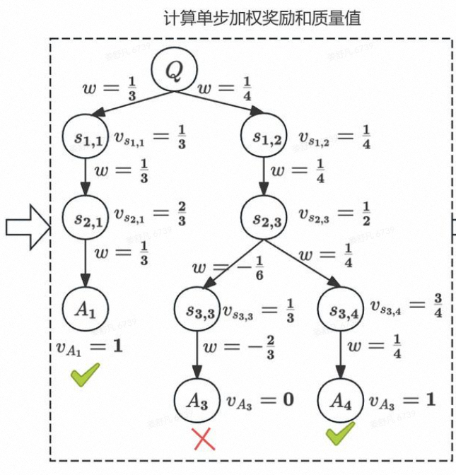

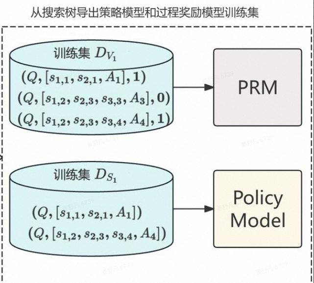

重复 step1 和 step2，最终得到训练好的策略模型和过程奖励模型

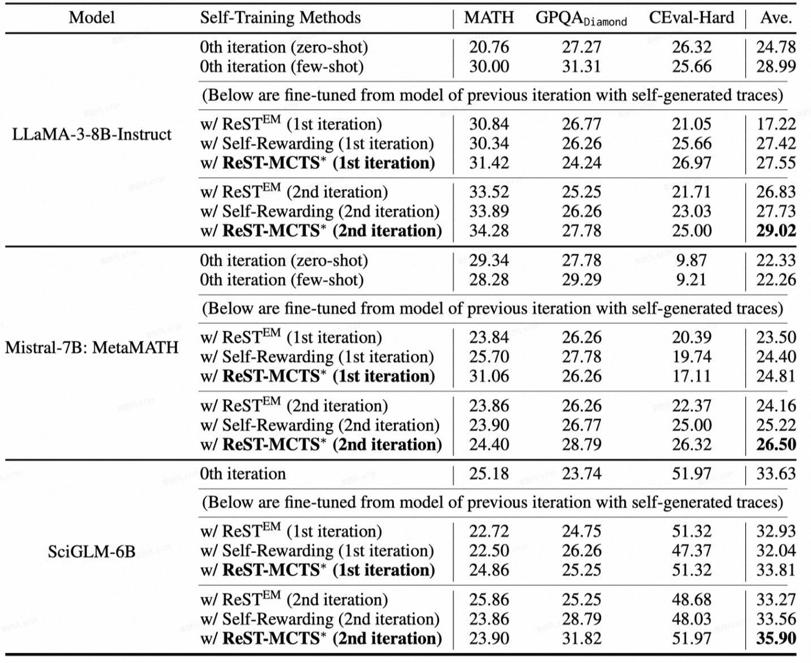

#### 把 AlphaZero 的策略迁移到 LLM

#### Super_MARIO

> 迁移 AlphaZero 的范式，迭代训练 Step-level Value Model $V_\phi(s)$ 和策略模型 $\pi_\theta$，且两者是具有不同最终层的相同模型

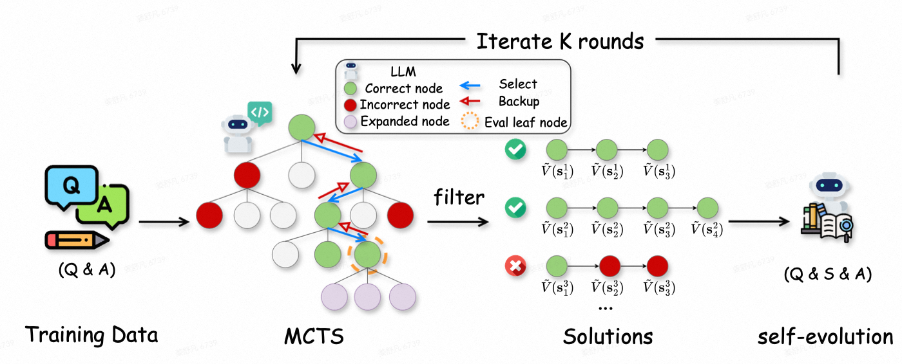

**状态更新 $f(s_{t+1}|s_t,a_t)$**

$$\pi_\theta(a_t|s_t) = LLM(a_t|s_t), s_{t+1} = Cat(s_t, a_t)$$

**Step-level Value Model $V_\phi(s)$**

创建训练信号的方法是使用 MCTS 中的 Simulation 思想，其中，$r(\cdot|s_t)$表示表示从状态$s_t$开始，一次模拟中最终结果的奖励：

$$V(s_t) = \frac{1}{N}\sum_{i=1}^N r(a_{t'\geq t}^{(i)}, s_{t'>t}^{(i)}|s_t)$$

对于任何给定的部分回复$s$，使用以下回归损失来训练 Step-level Value Model $V_\phi(s)$：

$$L_{V_\phi}(s) = (V_\phi(s) - V(s))^2$$

**PUCT algorithm**

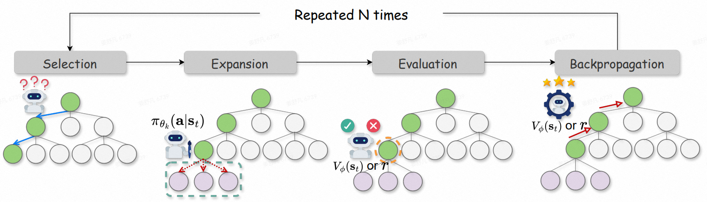

在 Selection 阶段，根据 PUCT 算法来探索树 $T_k$：

$$a_t = \arg\max_{a \in T_k} \left[Q^*(s_t, a) + c_{puct} \pi_{\theta_k}(a|s_t) \frac{\sqrt{N_{parent}(a)}}{1+N(s_t, a)} \right]$$

其中，先验$\pi(a|s_t)$被定义为步骤$a$中所有 token 的对数概率的平均值的指数：

$$\exp\left(\frac{1}{|a|}\sum \log \pi(a_j|a_{<j}, s_t)\right)$$

在选择阶段之后识别出的叶节点$s_t$的评估：

$$V^*(s_t)^{(i)} = (1-\lambda) \cdot V_{\phi_k}(s_t) + \lambda \cdot r(a_{t'\geq t}^{(i)}, s_{t'>t}^{(i)}|s_t)$$

MCTS 中的中间价值估计$V^*$和 Value Model 的训练信号$V$不同，参数$\lambda$用于平衡价值模型估计与 Simulation 过程中获得的经验奖励的贡献，$\lambda$采用了与 AlphaZero 相同的策略。但LLM推理的树深度远比围棋游戏浅（例如，最大深度为8），且容易到达终止节点，所以设置指示函数$\lambda = I_{terminal}(s_t)$，如果扩展的节点是终端节点，则返回奖励；否则，价值由模型$V_{\phi_k}$预测。

**Backup 策略**

完全参考AlphaZero的策略：

$$N(s,a) \leftarrow N(s,a) + 1$$

$$Q^*(s,a) \leftarrow \frac{1}{N(s,a)}\sum_{j=1}^i I_{s,a \rightarrow s_t} V^*(s_t)^{(j)}$$

**价值估计**

运行了N次模拟后，得到了最终的搜索树$T_k$，$Q(s_t,a_t)$表示在状态$s_t$下采取动作$a_t$所能获得的预期回报，这个值是根据贝尔曼方程计算的，故对于非终止节点：

$$Q(s_t,a_t) = r(s_t,a_t) + V(s_{t+1}) = V(s_{t+1})$$

于是可以直接拟合非终止节点的 State-Action Value：

$$V(s_{t+1}) = Q^*(s_t,a_t)$$

**迭代训练**

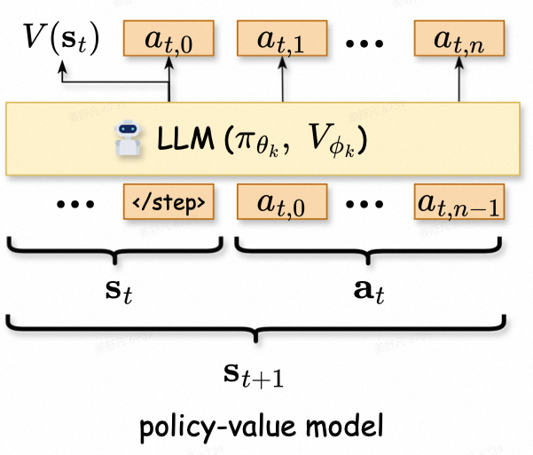

以一个预训练的语言模型（LLM）作为策略模型 $\pi_{\theta_1}$开始，添加了一个辅助线性层用于预测$V$，策略模型$\pi_\theta$和价值模型$V_\phi$共享了大部分参数。随着 MCTS 轮次中的模拟不断进行，终止节点的奖励($\pm1$)会被回传到其祖先节点，中间节点的估计值$Q^*$会逐渐收敛到真实的值，并且该值范围在$[-1,1]$之间。

**训练方法**

从第$k$轮 MCTS 构建的搜索树$T_k$中，采样出对应于终止节点的解路径，这些路径包括预测答案正确的路径（$x^+$）和预测答案错误的路径（$x^-$），以及这些路径上每个节点的价值估计。使用一个多任务损失函数来同时更新策略模型和价值模型:

$$
\arg\min_{\theta,\phi} -\log\pi_\theta(x^+|q) + \beta \cdot \left(\sum_{t=1}^{T(x^+)} \|V_\phi(s_t)-V(s_t)\|^2 + \sum_{t=1}^{T(x^-)} \|V_\phi(s_t)-V(s_t)\|^2\right)
$$


其中$T(x)$表示解路径$x$的步数，得到新的$\pi_{\theta_{k+1}}$和$V_{\phi_{k+1}}$后，开始下一轮 MCTS。

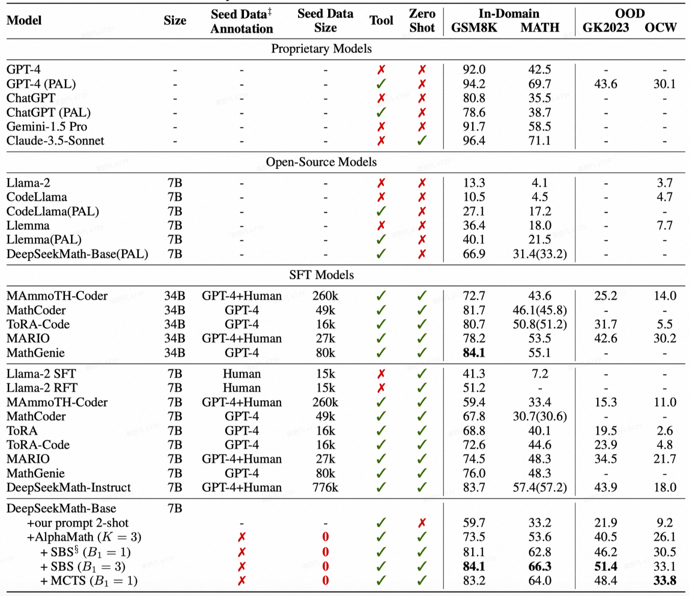